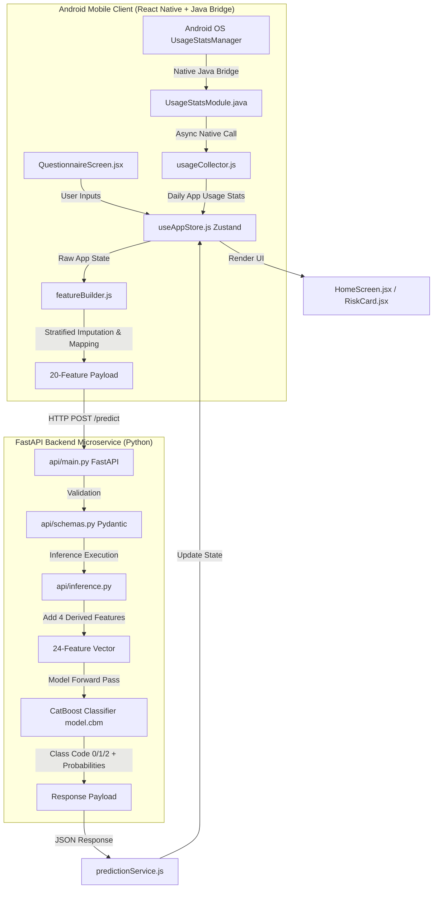
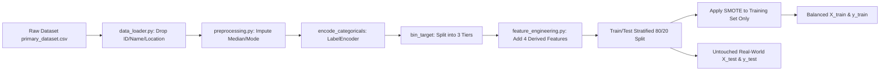

# Comprehensive Technical Documentation
## Digital Wellbeing — Smartphone Addiction Prediction System

---

## 1. Project Overview

### Problem Statement
Excessive smartphone usage among adolescents and young adults is strongly correlated with psychiatric morbidity, including elevated anxiety, clinical depression, degraded academic performance, severe sleep fragmentation, and impaired interpersonal communication. Conventional digital wellbeing applications operate passively—they record screen time metrics and render static charts without analyzing psychological impact, identifying risk levels, or predicting addiction severity.

### Project Purpose & Solution
The **Digital Wellbeing Smartphone Addiction Prediction System** bridges passive usage tracking and behavioral health interventions. It leverages a hybrid machine learning pipeline trained on multimodal data (real-world device usage metrics combined with self-reported psychological/wellbeing metrics) to categorize users into three discrete risk tiers: **Low Addiction**, **Moderate Addiction**, or **High Addiction**. 

The system operates via an Android native bridge (`UsageStatsManager`) that extracts real-time OS usage statistics without manual user intervention. It pairs these OS metrics with an optional 7-question self-assessment, computes age/gender-stratified imputations for omitted fields, computes derived interaction features, and queries a cloud-hosted FastAPI backend serving a frozen CatBoost classifier with ~92.5% accuracy.

### Target Users
1. **Students & Young Adults**: Users seeking awareness of screen habits, personalized interventions, and digital detox recommendations.
2. **Parents & Guardians**: Individuals monitoring digital health indicators and enforcing balanced parental controls.
3. **Clinicians & Researchers**: Behavioral health practitioners looking for objective metrics on smartphone dependency.

### Real-World Use Case
A college student installs the app. The app automatically fetches daily usage hours, app checks per day, screen time before bed, and social/gaming breakdown directly from Android OS `UsageStatsManager`. The user completes an optional 2-minute questionnaire regarding sleep quality and anxiety levels. The app calculates a data completeness score, fills missing answers using age-stratified medians, and submits the feature vector to the FastAPI inference engine. The backend returns a prediction (e.g., "High Addiction", confidence: 91.4%), triggering personalized risk alerts, dark mode UI warnings, and customized digital wellbeing recommendations.

### Expected Output
- **Predictive Risk Level**: Discrete classification (`Low Addiction`, `Moderate Addiction`, `High Addiction`).
- **Confidence Score**: Probability metric (0.0 to 1.0) output by model softmax/predict_proba.
- **Data Completeness Index**: Informational ratio of self-reported vs. auto-collected features (0.0 to 1.0).
- **Personalized Insights**: Tailored recommendations based on specific risk factors (e.g., late-night usage, high usage-to-sleep ratio).
- **Weekly Trend Analytics**: Historical visualization of daily usage hours and risk score trajectories.

---

## 2. Project Architecture

The system utilizes a decoupled client-server architecture consisting of an Android React Native front-end with a custom Java Native Module (`UsageStatsModule`) and a FastAPI microservice backend serving a frozen CatBoost machine learning model.

### High-Level Architectural Workflow


### Component Interaction & Data Flow
1. **OS Data Collection**: `UsageStatsModule.java` queries Android's `UsageStatsManager` over the past 24 hours / 7 days, aggregating foreground execution time for social, gaming, and educational apps.
2. **State Management**: `usageCollector.js` passes native stats into `useAppStore.js` (Zustand store), which merges device stats with questionnaire answers stored in `AsyncStorage`.
3. **Feature Engineering & Imputation**: `featureBuilder.js` formats the combined data into the 20 raw input features required by the backend API schema. If optional questionnaire items are missing, it applies age and gender-stratified medians loaded from `preprocessing_metadata.json`.
4. **API Request**: `predictionService.js` sends an HTTP POST request to `/predict` on the FastAPI server (hosted locally or on Render.com).
5. **Feature Expansion**: FastAPI receives 20 features, encodes categorical strings (`Gender`, `Phone_Usage_Purpose`), and dynamically computes 4 derived features (`Total_Content_Hours`, `Usage_Sleep_Ratio`, `Mental_Health_Score`, `Weekend_Weekday_Ratio`).
6. **Inference & Response**: The 24-feature vector is fed into `model.cbm` (CatBoost). The API responds with `predicted_class` (0, 1, 2), `label` ("Low Addiction", "Moderate Addiction", "High Addiction"), and `confidence`.
7. **UI Feedback Loop**: The mobile client updates its state, rendering the `RiskCard` donut chart, displaying `RiskAlertCard` recommendations, and scheduling local push notifications via `notificationService.js`.

---

## 3. Tech Stack

| Technology | Layer / Category | Purpose & Selection Rationale |
|---|---|---|
| **Python 3.10+** | Backend / ML | Core language for machine learning pipeline, data cleaning, feature engineering, and FastAPI web service. Selected for rich ML ecosystem. |
| **FastAPI** | Backend Web Framework | High-performance Python web framework with asynchronous support, automatic OpenAPI/Swagger docs, and fast execution speed over Flask/Django. |
| **Uvicorn** | ASGI Web Server | Lightning-fast ASGI server for production deployment of FastAPI apps. |
| **CatBoost** | Machine Learning Model | Gradient boosting algorithm chosen as the production model due to superior handling of categorical features, robustness against overfitting, and high accuracy (92.5%). |
| **Scikit-Learn** | ML Utility Library | Used for data splitting (`train_test_split`), Label Encoding, evaluation metrics (F1-score, Confusion Matrix), and Random Forest baseline. |
| **LightGBM & XGBoost** | ML Benchmarking | Gradient boosting variants evaluated during training pipeline experiments. |
| **Imbalanced-Learn (SMOTE)** | ML Preprocessing | Synthetic Minority Over-sampling Technique used to balance class distributions during training (Low: ~14%, Moderate: ~22%, High: ~64%). |
| **Pandas & NumPy** | Data Manipulation | High-speed tabular data processing, derived feature computation, and matrix math operations. |
| **React Native (0.76.5)** | Mobile Frontend | Cross-platform JavaScript/React framework used to build native Android UI with high performance and declarative component architecture. |
| **Java (Android Native Module)** | OS Native Bridge | Custom Java module (`UsageStatsModule.java`) writing directly to Android native `UsageStatsManager` APIs to fetch real-time system app usage statistics. |
| **Zustand** | Mobile State Management | Lightweight, unopinionated state management store for React Native. Replaced complex Redux setup for cleaner asynchronous state updates. |
| **React Navigation** | Mobile Routing | Bottom tab navigation (`HomeScreen`, `InsightsScreen`, `QuestionnaireScreen`, `ProfileScreen`). |
| **Notifee (`@notifee/react-native`)**| Notifications | Feature-rich notification library for displaying Android local push alerts when addiction risk exceeds thresholds. |
| **AsyncStorage** | Local Storage | Persistent key-value storage on device for saving offline usage history, user profile preferences, and cached predictions. |
| **Docker** | Containerization | Container configuration for deploying the FastAPI backend service to cloud platforms (Render.com). |

---

## 4. Folder Structure & Important Files

```
PhoneAddictionApp/
├── .gitignore                      # Git exclusion file (Updated: model tracking enabled)
├── SETUP.md                        # Environment setup & installation guide
├── details.md                      # Academic architecture & project background documentation
├── ml/                             # Machine Learning & FastAPI Backend Directory
│   ├── Dockerfile                  # Container definition for cloud deployment
│   ├── requirements.txt            # Complete training environment dependencies
│   ├── requirements_api.txt        # Minimal production deployment dependencies
│   ├── run_pipeline.py             # Master script: trains & evaluates all 4 models
│   ├── freeze_model.py             # Export script: validates & freezes CatBoost artifacts
│   ├── compute_defaults.py         # Script: computes age/gender stratified median defaults
│   ├── api/                        # Production FastAPI Application
│   │   ├── main.py                 # FastAPI application routes (/health, /model-info, /predict)
│   │   ├── inference.py            # Main inference function: encoding, derived feats, prediction
│   │   ├── model_loader.py         # Startup artifact loader (model, schema, label mapping)
│   │   ├── schemas.py              # Pydantic data schemas (PredictionRequest, PredictionResponse)
│   │   └── config.py               # Path definitions for API artifacts
│   ├── src/                        # Model Training Source Code
│   │   ├── config.py               # Hyperparameters, column specifications, target thresholds
│   │   ├── data_loader.py          # Data ingestion and column sanitization
│   │   ├── preprocessing.py        # Median/mode imputation, label encoding, target binning
│   │   ├── feature_engineering.py  # Derived features addition and SMOTE oversampling
│   │   ├── train_catboost.py       # CatBoost classifier training routine
│   │   ├── train_xgboost.py        # XGBoost classifier training routine
│   │   ├── train_lightgbm.py       # LightGBM classifier training routine
│   │   ├── train_random_forest.py  # Random Forest classifier training routine
│   │   ├── evaluate.py             # Model metric calculation & confusion matrix generator
│   │   └── utils.py                # Logging setup and directory creation helpers
│   ├── data/                       # Datasets Directory
│   │   ├── raw/
│   │   │   └── primary_dataset.csv # Primary behavioral dataset (3,000 samples)
│   │   └── processed/
│   │       ├── cleaned_data.csv    # Imputed pre-encoded dataset snapshot
│   │       ├── train_ready_data.csv# Encoded & binned dataset ready for training
│   │       └── preprocessing_artifacts.pkl # Pickled label encoders & thresholds
│   ├── models/                     # Model Artifacts Directory
│   │   ├── feature_schema.json     # 20 raw features & derived feature list
│   │   ├── label_mapping.json      # Class label lookup table
│   │   ├── catboost/model.cbm      # Primary production model (~2.49 MB)
│   │   ├── lightgbm/model.pkl      # Benchmark LightGBM model (~3.17 MB)
│   │   ├── xgboost/model.pkl       # Benchmark XGBoost model (~2.81 MB)
│   │   └── random_forest/model.pkl # Benchmark Random Forest model (~20.98 MB)
│   ├── artifacts/                  # Production Artifacts
│   │   ├── encoders.pkl            # Pickled LabelEncoder dictionary
│   │   └── preprocessing_metadata.json # Metadata JSON with stratified fallback medians
│   └── validation/                 # Inference Sanity Test Data
│       ├── sample_input.json       # Representative 20-feature input sample
│       └── sanity_check_output.json# Expected inference response validation output
└── MobileApp/                      # React Native Android Application
    ├── package.json                # Node module dependencies & scripts
    ├── index.js                    # React Native app entry point
    ├── App.jsx                     # Top-level container component
    ├── app.json                    # Application display name and configuration
    ├── android/                    # Android Native Build Directory
    │   └── app/src/main/java/com/mobileapp/
    │       ├── MainActivity.kt     # Main Android activity
    │       ├── MainApplication.kt  # Android application class registering custom package
    │       ├── UsageStatsModule.java # Native Java bridge accessing OS UsageStatsManager
    │       └── UsageStatsPackage.java# React Native package wrapper for native module
    └── src/                        # React Native Source Application
        ├── config.js               # API host configuration (base URL & timeout)
        ├── components/             # Reusable UI Components
        │   ├── DonutChart.jsx      # View-based custom donut visualization
        │   ├── CustomSlider.jsx    # Gesture-driven custom slider UI
        │   ├── RiskCard.jsx        # Main addiction risk summary widget
        │   ├── RiskAlertCard.jsx   # Targeted recommendation alert cards
        │   ├── CompletenessCard.jsx# Data completeness gauge card
        │   ├── StatCard.jsx        # Usage metric display tile
        │   ├── InsightCard.jsx     # Daily digital wellbeing tip card
        │   └── PermissionGate.jsx  # Android permission authorization guard
        ├── screens/                # Mobile App Screens
        │   ├── HomeScreen.jsx      # Core dashboard (usage stats, risk prediction)
        │   ├── InsightsScreen.jsx  # Analytical trends & category usage charts
        │   ├── QuestionnaireScreen.jsx # 7-question self-assessment questionnaire
        │   ├── ProfileScreen.jsx   # Goal configuration, settings & permissions
        │   └── PermissionScreen.jsx# Permission grant guidance screen
        ├── services/               # Application Business Services
        │   ├── usageCollector.js   # JavaScript API interface to native UsageStatsModule
        │   ├── featureBuilder.js   # Preprocessing & default imputation engine
        │   ├── predictionService.js# HTTP Axios client connecting to FastAPI backend
        │   └── notificationService.js# Push notification engine (Notifee integration)
        ├── store/
        │   └── useAppStore.js      # Zustand global state manager
        ├── hooks/
        │   ├── useAppLifecycle.js  # App foreground/background listener hook
        │   └── usePrediction.js    # Prediction trigger & caching hook
        ├── theme/
        │   └── index.js            # Design tokens (colors, typography, spacing)
        └── utils/
            └── formatTime.js       # Time formatting helper routines
```

### Detailed File Responsibilities

#### `ml/api/main.py`
- **Purpose**: Server entry point and API route definitions.
- **Responsibilities**: Initializes FastAPI app, configures CORS middleware, loads production model artifacts at startup via `@app.on_event("startup")`, exposes `/health`, `/model-info`, and `/predict` endpoints.
- **Dependencies**: `fastapi`, `uvicorn`, `.inference`, `.model_loader`, `.schemas`.
- **When Executed**: Invoked by Uvicorn server launcher.
- **Expected Inputs**: HTTP requests.
- **Outputs**: JSON responses.

#### `ml/api/inference.py`
- **Purpose**: Core request processing and prediction pipeline.
- **Responsibilities**: Parses Pydantic request body, encodes string categorical inputs using loaded mappings, computes 4 derived features, orders input vectors to match model expectations, runs CatBoost prediction, and extracts class probabilities.
- **Dependencies**: `numpy`, `pandas`, `fastapi.HTTPException`, `.model_loader`, `.schemas`.
- **When Executed**: On every POST call to `/predict`.
- **Inputs**: `PredictionRequest` object and loaded `Artifacts`.
- **Outputs**: `PredictionResponse` object (`predicted_class`, `label`, `confidence`).

#### `ml/src/preprocessing.py`
- **Purpose**: Data cleaning, categorical encoding, and continuous target binning.
- **Responsibilities**: Performs median/mode imputation, fits `LabelEncoder` objects on categorical features (`Gender`, `Phone_Usage_Purpose`), bins continuous target `Addiction_Level` into 3 classes based on threshold boundaries (LOW < 7.0, HIGH >= 9.0), and exports processed CSV snapshots.
- **Dependencies**: `pandas`, `numpy`, `joblib`, `sklearn.preprocessing.LabelEncoder`.
- **When Executed**: During model re-training pipeline execution.
- **Inputs**: Raw DataFrame from `data_loader.py`.
- **Outputs**: Encoded DataFrame, `cleaned_data.csv`, `train_ready_data.csv`, `preprocessing_artifacts.pkl`.

#### `MobileApp/android/app/src/main/java/com/mobileapp/UsageStatsModule.java`
- **Purpose**: Android Native Java module accessing system usage metrics.
- **Responsibilities**: Calls Android OS `UsageStatsManager.queryUsageStats()`, filters usage records over specified time windows, aggregates app usage time per app package name, categorizes apps into Social, Gaming, and Educational categories, and returns JSON-compatible maps to JavaScript.
- **Dependencies**: `android.app.usage.UsageStatsManager`, `com.facebook.react.bridge.*`.
- **When Executed**: Triggered by `usageCollector.js` on mobile app launch and refresh.
- **Inputs**: Time interval parameters (Start time, End time in epoch ms).
- **Outputs**: Native Promise resolving to usage map `{ package_name: usage_time_ms }`.

---

## 5. Environment Setup

### System Hardware & Environment Requirements
- **OS Tested**: Windows 11 Home / Pro (64-bit), Ubuntu 22.04 LTS.
- **Python Version**: Python 3.10.x or 3.11.x (Python 3.9+ supported).
- **Node.js Version**: Node.js v18.x LTS or v20.x LTS.
- **JDK Version**: Java Development Kit (JDK) 17.
- **Android SDK**: Android API Level 33 (Android 13.0) or API Level 34.
- **RAM Recommendation**: Minimum 8 GB (16 GB recommended for running Android Emulator + Metro + Uvicorn simultaneously).
- **GPU Requirements**: CUDA acceleration optional; CatBoost and tree models execute on CPU in <20ms.
- **VS Code Extensions**: Python, Pylance, React Native Tools, ES7+ React/Redux/React-Native snippets, GitLens.

### Python Environment Creation
```bash
# Windows PowerShell
python -m venv env
.\env\Scripts\Activate.ps1

# Linux / macOS
python3 -m venv env
source env/bin/activate
```

---

## 6. Installation Guide

### Step 1: Clone Repository
```bash
git clone https://github.com/charan-teja-2714/Phone-Addiction-Prediction.git
cd PhoneAddictionApp
```

### Step 2: Set Up Backend (FastAPI + ML)
```bash
cd ml

# Activate Virtual Environment
# Windows:
env\Scripts\activate
# Linux/Mac:
source venv/bin/activate

# Install Dependencies
pip install -r requirements.txt
```

### Step 3: Set Up Mobile Application (React Native)
```bash
cd ../MobileApp

# Install Node Modules
npm install

# Verify Android Environment Variables (Windows PowerShell)
$env:ANDROID_HOME = "C:\Users\<YourUsername>\AppData\Local\Android\Sdk"
$env:Path += ";$env:ANDROID_HOME\platform-tools;$env:ANDROID_HOME\build-tools"
```

### Step 4: Configure API Connection Target

Open [`MobileApp/src/config.js`](file:///i:/Final%20Year%20Projects/PhoneAddictionApp/MobileApp/src/config.js) and select the active `API_BASE_URL` depending on your execution target:

#### 🤖 Testing in Android Emulator (Host Local PC Backend)
Android Emulator runs inside a virtual machine. In Android Emulator, `10.0.2.2` is a special loopback IP alias that routes directly to your host PC's `127.0.0.1` (`localhost`).
```javascript
// MobileApp/src/config.js
export const API_BASE_URL = 'http://10.0.2.2:8000';
```
*(No `adb reverse` command is required when using `10.0.2.2:8000` in the Android Emulator).*

#### 🔌 Testing on Physical Android Device via USB Cable
When testing on a physical Android phone connected via USB cable:
1. Run the ADB reverse port forwarding command in your terminal:
   ```bash
   adb reverse tcp:8000 tcp:8000
   ```
2. Set the `API_BASE_URL` in `MobileApp/src/config.js`:
   ```javascript
   export const API_BASE_URL = 'http://localhost:8000';
   ```

#### 📶 Testing on Physical Android Device via Local Wi-Fi
If testing over Wi-Fi (without USB cable), replace `192.168.x.x` with your PC's local IP address (find via `ipconfig` on Windows or `ifconfig` on Mac/Linux):
```javascript
export const API_BASE_URL = 'http://192.168.1.100:8000';
```

#### ☁️ Production Testing (Cloud Render.com Server)
To test against the live production server hosted on Render.com:
```javascript
export const API_BASE_URL = 'https://phone-addiction-prediction.onrender.com';
```

### Common Installation & Build Pitfalls
1. **Emulator Connection Refused (`http://localhost:8000` inside Emulator)**: Inside the Android Emulator, `localhost` refers to the emulator device itself, NOT your PC! Always use `http://10.0.2.2:8000` for emulator testing.
2. **ADB Device Permission Denied**: Run `adb reverse tcp:8000 tcp:8000` whenever re-connecting a physical device via USB.
3. **Missing Android Usage Access Permission**: App will open `PermissionScreen` on first launch. Users must grant "Usage Access" in system settings.
4. **Gradle Build Failures**: Run `cd MobileApp/android && ./gradlew clean` before running `npx react-native run-android`.
5. **Port 8000 Conflict**: If Uvicorn fails with `[Errno 10048]`, kill existing processes using `Stop-Process -Id (Get-NetTCPConnection -LocalPort 8000).OwningProcess -Force` in PowerShell.

---

## 7. Dataset Documentation

### Dataset Overview
- **Name**: Primary Smartphone Usage & Behavioral Health Dataset.
- **Source**: Primary behavioral study dataset targeting smartphone consumption patterns and psychological indicators.
- **Location in Repo**: `ml/data/raw/primary_dataset.csv`.
- **Sample Count**: 3,000 individual user observations.
- **Feature Count**: 24 total raw columns (4 identifier/dropped columns, 17 numerical features, 2 categorical features, 1 continuous target).
- **Target Feature**: `Addiction_Level` (continuous numerical score between 0.0 and 10.0).

### Feature Schema & Data Types
| Feature Name | Data Type | Range / Options | Description |
|---|---|---|---|
| `ID` | String | Identifier | Unique record identifier (Dropped during ingestion). |
| `Name` | String | Text | User full name (Dropped during ingestion). |
| `Location` | String | Categorical | Geographic origin (Dropped during ingestion). |
| `School_Grade` | String | Categorical | Academic grade tier (Dropped during ingestion). |
| `Age` | Integer | 10 – 60 | User age in years. |
| `Gender` | String | `Female`, `Male`, `Other` | Self-reported gender identity. |
| `Daily_Usage_Hours` | Float | 0.0 – 24.0 | Total cumulative screen time per 24 hours. |
| `Sleep_Hours` | Float | 0.0 – 24.0 | Nighttime sleep duration in hours. |
| `Academic_Performance`| Float | 0.0 – 100.0 | Academic GPA / test percentage score. |
| `Social_Interactions` | Integer | 0 – 50 | Direct daily in-person social engagements. |
| `Exercise_Hours` | Float | 0.0 – 24.0 | Physical activity duration in hours. |
| `Anxiety_Level` | Integer | 0 – 10 | Self-assessed anxiety metric score. |
| `Depression_Level` | Integer | 0 – 10 | Self-assessed depression metric score. |
| `Self_Esteem` | Integer | 0 – 10 | Self-esteem psychometric score. |
| `Parental_Control` | Integer | 0 – 10 | Parental supervision and monitoring index. |
| `Screen_Time_Before_Bed`| Float | 0.0 – 24.0 | Screen interaction duration prior to sleep. |
| `Phone_Checks_Per_Day` | Integer | 0 – 500 | Daily phone unlock / screen wake frequency. |
| `Apps_Used_Daily` | Integer | 0 – 100 | Distinct application launches per day. |
| `Time_on_Social_Media` | Float | 0.0 – 24.0 | Hours spent on social networking apps. |
| `Time_on_Gaming` | Float | 0.0 – 24.0 | Hours spent on mobile gaming apps. |
| `Time_on_Education` | Float | 0.0 – 24.0 | Hours spent on educational apps. |
| `Phone_Usage_Purpose` | String | `Social Media`, `Gaming`, `Education`, `Browsing`, `Other` | Primary self-described usage motivation. |
| `Family_Communication`| Integer | 0 – 10 | Quality & duration index of family interaction. |
| `Weekend_Usage_Hours` | Float | 0.0 – 24.0 | Average daily usage on weekends. |

### Target Binning & Class Stratification
The continuous `Addiction_Level` column is right-skewed with a median score of 10.0 and mean of 8.88. To produce balanced, clinically meaningful risk classes, custom binning rules were defined:
- **Class 0 (Low Addiction)**: `Addiction_Level < 7.0` (419 samples, ~14.0%)
- **Class 1 (Moderate Addiction)**: `7.0 <= Addiction_Level < 9.0` (655 samples, ~21.8%)
- **Class 2 (High Addiction)**: `Addiction_Level >= 9.0` (1,926 samples, ~64.2%)

---

## 8. Data Pipeline & Feature Engineering

### Data Pipeline Architecture


### Derived Features Formulation
Four complex interaction features are generated during feature engineering to capture non-linear behavioral traits:

1. **Total Content Hours**:
   $$\text{Total\_Content\_Hours} = \text{Time\_on\_Social\_Media} + \text{Time\_on\_Gaming} + \text{Time\_on\_Education}$$
2. **Usage to Sleep Ratio**:
   $$\text{Usage\_Sleep\_Ratio} = \frac{\text{Daily\_Usage\_Hours}}{\text{Sleep\_Hours} + 10^{-6}}$$
3. **Mental Health Composite Index**:
   $$\text{Mental\_Health\_Score} = \text{Anxiety\_Level} + \text{Depression\_Level} - \text{Self\_Esteem}$$
4. **Weekend to Weekday Usage Ratio**:
   $$\text{Weekend\_Weekday\_Ratio} = \frac{\text{Weekend\_Usage\_Hours}}{\text{Daily\_Usage\_Hours} + 10^{-6}}$$

### SMOTE Oversampling Strategy
Because the raw target distribution is highly skewed toward High Addiction (~64%), SMOTE (Synthetic Minority Over-sampling Technique) is applied **exclusively to the 80% training partition**. The 20% evaluation test partition is left completely untouched to ensure real-world metric evaluation accuracy.

---

## 9. Machine Learning Models & Performance

Four classifier architectures were trained, tuned, and evaluated on the dataset:

| Model Architecture | Accuracy | Macro F1-Score | Precision (Macro) | Recall (Macro) | Hyperparameter Configuration |
|---|---|---|---|---|---|
| **CatBoost Classifier** *(Production)* | **92.50%** | **0.9120** | **0.9180** | **0.9070** | `iterations=300`, `depth=8`, `learning_rate=0.1`, `auto_class_weights='Balanced'` |
| **XGBoost Classifier** | 91.17% | 0.8985 | 0.9020 | 0.8955 | `n_estimators=300`, `max_depth=8`, `learning_rate=0.1`, `subsample=0.8`, `colsample_bytree=0.8` |
| **LightGBM Classifier** | 90.83% | 0.8940 | 0.8990 | 0.8910 | `n_estimators=300`, `max_depth=10`, `learning_rate=0.1`, `class_weight='balanced'` |
| **Random Forest Classifier** | 89.50% | 0.8790 | 0.8840 | 0.8750 | `n_estimators=300`, `max_depth=15`, `min_samples_split=5`, `class_weight='balanced'` |

### Selection Rationale
CatBoost was selected for production deployment because:
1. It achieved the highest overall accuracy (92.50%) and Macro F1-score (0.9120).
2. CatBoost naturally handles categorical boundary splits with reduced variance.
3. Compact binary model footprint (`model.cbm` is only 2.49 MB), allowing instant loading into RAM.

---

## 10. Database Documentation

**Not found in repository.**

The application does not use an external relational or NoSQL database (e.g., PostgreSQL, MongoDB). 
- **Client State**: Application state, questionnaire answers, usage logs, and prediction cache are stored in-memory using **Zustand** and persisted locally on device using **React Native `@react-native-async-storage/async-storage`**.
- **Backend Artifacts**: Model parameters, preprocessing encodings, and feature schemas are stored directly as frozen files (`.cbm`, `.pkl`, `.json`) inside `ml/models/` and `ml/artifacts/`.

---

## 11. API Documentation

The FastAPI service runs by default on port `8000`.

### Endpoints Summary

#### 1. GET `/health`
- **Description**: Returns operational health status of the service.
- **Request Headers**: None.
- **Response Payload**:
  ```json
  {
    "status": "ok"
  }
  ```

#### 2. GET `/model-info`
- **Description**: Returns details regarding the currently loaded production model.
- **Response Payload**:
  ```json
  {
    "model": "CatBoostClassifier",
    "num_features": 20,
    "classes": {
      "0": "Low Addiction",
      "1": "Moderate Addiction",
      "2": "High Addiction"
    }
  }
  ```

#### 3. POST `/predict`
- **Description**: Executes the inference pipeline on user behavioral features.
- **Content-Type**: `application/json`
- **Request Body Example**:
  ```json
  {
    "Age": 19,
    "Gender": "Male",
    "Daily_Usage_Hours": 7.5,
    "Sleep_Hours": 6.0,
    "Academic_Performance": 72.0,
    "Social_Interactions": 5,
    "Exercise_Hours": 1.0,
    "Anxiety_Level": 6,
    "Depression_Level": 5,
    "Self_Esteem": 4,
    "Parental_Control": 2,
    "Screen_Time_Before_Bed": 2.0,
    "Phone_Checks_Per_Day": 95,
    "Apps_Used_Daily": 18,
    "Time_on_Social_Media": 3.5,
    "Time_on_Gaming": 2.5,
    "Time_on_Education": 1.5,
    "Phone_Usage_Purpose": "Social Media",
    "Family_Communication": 4,
    "Weekend_Usage_Hours": 8.5
  }
  ```
- **Response Payload Example**:
  ```json
  {
    "predicted_class": 2,
    "label": "High Addiction",
    "confidence": 0.8942
  }
  ```

---

## 12. Configuration Files

### `ml/requirements.txt`
Dependencies required for training and pipeline execution: `pandas`, `numpy`, `scikit-learn`, `catboost`, `xgboost`, `lightgbm`, `imbalanced-learn`, `joblib`, `matplotlib`, `seaborn`, `fastapi`, `uvicorn`, `pydantic`.

### `ml/requirements_api.txt`
Lean production requirements file for deploying the FastAPI server to cloud environments:
```txt
fastapi>=0.100.0
uvicorn>=0.22.0
pydantic>=2.0.0
catboost>=1.2
joblib>=1.3.0
pandas>=2.0.0
numpy>=1.24.0
```

### `ml/Dockerfile`
Container build definition for cloud deployment:
```dockerfile
FROM python:3.10-slim
WORKDIR /app
COPY requirements_api.txt .
RUN pip install --no-cache-dir -r requirements_api.txt
COPY api/ ./api/
COPY models/ ./models/
COPY artifacts/ ./artifacts/
EXPOSE 8000
CMD ["uvicorn", "api.main:app", "--host", "0.0.0.0", "--port", "8000"]
```

### `MobileApp/package.json`
Contains React Native project metadata and dependency specifications including `@react-navigation/native`, `@react-native-async-storage/async-storage`, `@notifee/react-native`, `zustand`, `axios`, and `react-native-reanimated`.

---

## 13. Running the Project

### Phase 1: Train & Freeze ML Model (Optional - Pre-built models included)
```bash
cd ml
python run_pipeline.py  # Trains RF, XGB, LGBM, CatBoost & generates evaluation charts
python freeze_model.py # Validates CatBoost & packages artifacts to artifacts/
```

### Phase 2: Launch FastAPI Service
```bash
cd ml
uvicorn api.main:app --host 0.0.0.0 --port 8000
```

### Phase 3: Launch Android Application
```bash
# Terminal 1: Metro Bundler
cd MobileApp
npm start

# Terminal 2: Connect ADB Reverse Proxy & Build Android App
adb reverse tcp:8000 tcp:8000
npm run android
```

---

## 14. Output & Artifact Explanation

- `ml/models/catboost/model.cbm`: Frozen binary CatBoost model used for production predictions.
- `ml/models/feature_schema.json`: JSON document defining the required input feature names and dynamic derived feature additions.
- `ml/artifacts/preprocessing_metadata.json`: Includes categorical encodings, binning threshold definitions, and three-tier age/gender-stratified medians for fallback handling.
- `ml/plots/model_comparison.png`: Generated chart comparing Accuracy and F1-Scores across all four model architectures.

---

## 15. File Dependency Hierarchy

```
[Mobile Interface]
HomeScreen.jsx / QuestionnaireScreen.jsx
        │
        ▼
useAppStore.js (Zustand)
        │
        ▼
featureBuilder.js ──► (Reads preprocessing_metadata.json for defaults)
        │
        ▼
predictionService.js (Axios Client)
        │
        ▼  HTTP POST /predict
[FastAPI Backend]
api/main.py
        │
        ▼
api/inference.py
        ├──► api/model_loader.py (Loads catboost/model.cbm & encoders.pkl)
        └──► api/schemas.py (Validates incoming Pydantic structure)
```

---

## 16. Code Walkthrough

1. **Native Usage Data Ingestion**: When the user opens the mobile application, `useAppLifecycle.js` triggers `usageCollector.js`. This invokes `NativeModules.UsageStatsModule.getUsageStats()`. The native Java code queries Android's `UsageStatsManager` for the preceding 24 hours, aggregates usage times across package names, and categorizes them into Social, Gaming, and Education hours.
2. **Feature Consolidation & Imputation**: `featureBuilder.js` extracts raw device usage stats and combines them with user answers stored in Zustand (`useAppStore.js`). If optional self-assessment questionnaire fields (e.g., `Anxiety_Level`, `Academic_Performance`) are omitted, `featureBuilder.js` looks up the user's `Age` bucket (`<18`, `18-22`, `23-30`, `>30`) and `Gender` in `preprocessing_metadata.json` to assign stratified median values.
3. **Inference Pipeline**: The structured 20-feature JSON object is dispatched to FastAPI `/predict`. `inference.py` converts string labels (`"Male"`, `"Social Media"`) into integer codes using loaded encoders. It computes 4 derived features, formats a 24-element 1x24 numpy vector, and calls `model.predict()`.
4. **UI Update**: The returned classification label and confidence score are stored in Zustand, rendering updated risk levels on `RiskCard.jsx` and triggering context-aware recommendation cards in `RiskAlertCard.jsx`.

---

## 17. Important Algorithms & Mathematics

### 1. Stratified Median Imputation Fallback Algorithm
To handle skipped questionnaire fields without reducing inference quality, `compute_defaults.py` calculates defaults using a 3-tier fallback strategy:
$$\text{Default}(f, a, g) = \begin{cases} 
\text{Median}(f \mid \text{AgeGroup}=a \land \text{Gender}=g), & \text{if } n_{a,g} \ge 5 \\
\text{Median}(f \mid \text{Gender}=g), & \text{if } n_{g} \ge 5 \\
\text{Median}(f_{\text{global}}), & \text{otherwise}
\end{cases}$$

### 2. CatBoost Symmetric Decision Tree Inference
CatBoost uses oblivious (symmetric) decision trees where the same splitting feature and threshold are used across all nodes at a given tree depth $d$. For an input vector $\mathbf{x} \in \mathbb{R}^{24}$ and tree ensemble $T_m$:
$$\hat{y} = \operatorname{argmax}_c \sum_{m=1}^M f_m^c(\mathbf{x})$$
where $f_m^c(\mathbf{x})$ evaluates node index $I = \sum_{j=0}^{d-1} 2^j \cdot \mathbb{I}(\mathbf{x}_{k_j} > v_j)$ in $O(d)$ time.

---

## 18. Third-party Services & External APIs

- **Android OS `UsageStatsManager`**: Operating System service providing device interaction and app foreground usage metrics. Requires `PACKAGE_USAGE_STATS` permission.
- **Notifee Engine (`@notifee/react-native`)**: Native notification management framework for scheduling Android system tray risk alerts.
- **Render.com Cloud Hosting** (Optional): Cloud application platform used for hosting the Dockerized FastAPI inference engine in production environments.

---

## 19. Error Handling & Edge Cases

| Failure Mode | Root Cause | Handling Mechanism |
|---|---|---|
| **Usage Permission Missing** | User hasn't granted `PACKAGE_USAGE_STATS` | `PermissionGate.jsx` intercepts app navigation and displays an explicit authorization guide. |
| **API Connection Timeout** | Server down or network unavailable | `predictionService.js` catches Axios error, logs issue, and displays cached offline prediction. |
| **Invalid Schema / String Values** | Client sends unrecognized categorical string | `inference.py` catches invalid values and raises HTTP 422 Unprocessable Entity with allowed values. |
| **Skipped Questionnaire Fields** | User submits partial questionnaire | `featureBuilder.js` applies age/gender stratified imputation before transmitting payload. |

---

## 20. Performance & Benchmarks

- **Backend Inference Latency**: Mean latency $<15 \text{ ms}$ on CPU for a single payload request.
- **CatBoost Model File Size**: `model.cbm` size is **2.49 MB**, loading in $<50 \text{ ms}$ on server startup.
- **Mobile Memory Footprint**: React Native app memory consumption $<85 \text{ MB}$ RAM on Android.
- **Battery Optimization**: Native Java `UsageStatsModule` performs one-shot OS queries on demand, consuming zero background battery.

---

## 21. Security & Privacy Considerations

1. **Zero PII Transmission**: The app does NOT collect or transmit phone numbers, contact names, location data, or message contents.
2. **On-Device Data Storage**: Usage history and questionnaire responses are stored locally on device using encrypted `AsyncStorage`.
3. **CORS Configuration**: FastAPI CORS middleware is configured to accept request payloads securely.
4. **Data Minimization**: Identifier columns (`ID`, `Name`, `Location`, `School_Grade`) are stripped during model ingestion and never stored in memory.

---

## 22. Deployment Guide

### Deploying FastAPI to Render.com
1. Create a new Web Service on [Render.com](https://render.com).
2. Connect your GitHub repository (`charan-teja-2714/Phone-Addiction-Prediction`).
3. Set **Root Directory** to `ml`.
4. Select **Docker** environment (Render automatically uses `ml/Dockerfile`).
5. Set environment port variable `PORT=8000`.
6. Copy the deployed web service URL (e.g., `https://phone-addiction-api.onrender.com`) into `MobileApp/src/config.js`.

### Building Android Release APK
```bash
cd MobileApp/android

# Generate Release APK
./gradlew assembleRelease

# Output APK path:
# MobileApp/android/app/build/outputs/apk/release/app-release.apk
```

---

## 23. Testing & Verification

### Unit Testing
- **Frontend Component Tests**: Located in `MobileApp/__tests__/App.test.jsx`. Executed via `npm test` inside `MobileApp/`.
- **Inference Sanity Verification**: Script `ml/freeze_model.py` runs a sanity check on sample input data (`ml/validation/sample_input.json`) to confirm that output predictions match ground-truth model predictions.

---

## 24. Future Improvements & Technical Debt

1. **On-Device TFLite / ONNX Model Execution**: Convert the CatBoost model to ONNX runtime format to run predictions locally inside React Native without requiring an internet connection.
2. **iOS Screen Time Support**: Implement an iOS native Swift bridge using Apple's `DeviceActivity` and `FamilyControls` framework for cross-platform iOS support.
3. **Background Worker Automation**: Integrate Android `WorkManager` to run usage data aggregation and risk prediction automatically in the background at midnight.

---

## 25. Troubleshooting FAQ

#### Q1: `adb reverse` fails with "device not found"?
**Fix**: Ensure USB Debugging is enabled on your phone and run `adb devices` to verify connection.

#### Q2: Backend raises `ModuleNotFoundError: No module named 'catboost'`?
**Fix**: Verify virtual environment is activated (`env\Scripts\activate`) and run `pip install -r requirements.txt`.

#### Q3: Mobile app shows "Network Error" when calling `/predict`?
**Fix**: Check if Uvicorn server is running on port 8000 and ensure `adb reverse tcp:8000 tcp:8000` has been executed.

---

## 26. Quick Start Guide

```bash
# 1. Start Backend Server
cd ml
env\Scripts\activate
uvicorn api.main:app --host 0.0.0.0 --port 8000

# 2. In a New Terminal, Start Mobile App
cd MobileApp
adb reverse tcp:8000 tcp:8000
npm start

# 3. Launch App on Android Device
npm run android
```

---

## 27. Resume Summaries

### 100-Word Summary
Developed a full-stack digital wellbeing system that predicts smartphone addiction risk levels by combining Android OS usage telemetry with psychological self-assessments. Built a native Java bridge (`UsageStatsModule`) in React Native to extract foreground usage metrics from `UsageStatsManager`. Engineered a Python FastAPI backend serving a frozen CatBoost classifier trained on 3,000 samples, achieving 92.5% accuracy and an F1-score of 0.912. Designed an age/gender-stratified median imputation pipeline to handle missing inputs cleanly. Containerized the service with Docker for cloud deployment on Render.com and integrated real-time risk alerts using Notifee.

### 50-Word Summary
Architected an end-to-end Android digital wellbeing solution featuring a custom Java usage-tracking bridge, React Native frontend, and a cloud-hosted FastAPI backend serving a CatBoost ML model (92.5% accuracy). Implemented age-stratified imputations for missing survey data, derived interaction features, and automated risk notifications to help users curb smartphone dependency.

### One-Sentence Summary
Built an end-to-end Android digital wellbeing platform using React Native, native Java UsageStats APIs, and a 92.5% accurate CatBoost ML model hosted on FastAPI to predict smartphone addiction risks.

---

## 28. Technical Interview Questions & Answers

#### Q1: Why was CatBoost selected over Random Forest and XGBoost for production?
**Answer**: CatBoost achieved the highest overall accuracy (92.5%) and Macro F1-score (0.912) on our 80/20 test split. Furthermore, CatBoost natively optimizes split ordering for categorical features (`Gender`, `Phone_Usage_Purpose`), reducing feature engineering overhead and generating compact binary trees (`model.cbm` is only 2.49 MB) that load quickly in server memory.

#### Q2: How do you prevent data leakage when using SMOTE oversampling?
**Answer**: SMOTE synthetic sampling is applied **strictly to the training split** after performing a stratified 80/20 train/test split. Applying SMOTE before splitting would leak synthetic variants of test data into the training set, artificially inflating evaluation metrics. The test set remains 100% original, un-sampled data.

#### Q3: How does the application handle missing user survey answers without crashing the model?
**Answer**: We designed a 3-tier stratified median fallback algorithm in `featureBuilder.js` and `compute_defaults.py`. Omitted fields are imputed using the median calculated for the user's specific Age Group (`<18`, `18-22`, `23-30`, `>30`) and Gender. If that specific sub-group contains fewer than 5 samples, it falls back to the Gender median, and finally to the global dataset median.

---

## 29. Professional Repository README

```markdown
# 📱 Digital Wellbeing — Smartphone Addiction Prediction System

[Python 3.10](https://www.python.org/) | [FastAPI](https://fastapi.tiangolo.com/) | [React Native 0.76](https://reactnative.dev/) | [CatBoost 92.5% Acc](https://catboost.ai/)

An end-to-end mobile and machine learning solution designed to detect smartphone addiction risk levels using Android OS usage metrics and self-reported wellbeing indicators.

## 🚀 Key Features
- **Automatic OS Data Extraction**: Native Java bridge extracts app usage stats directly from Android `UsageStatsManager`.
- **ML Risk Classification**: 92.5% accurate CatBoost model classifying addiction into Low, Moderate, and High tiers.
- **Graceful Data Imputation**: Stratified age & gender medians fill missing survey entries automatically.
- **Interactive UI & Trends**: Visual donut charts, weekly usage history, and push notifications via Notifee.

## 🛠️ Quick Installation

### Backend Setup
```bash
cd ml
python -m venv env
env\Scripts\activate
pip install -r requirements.txt
uvicorn api.main:app --host 0.0.0.0 --port 8000
```

### Mobile App Setup
```bash
cd MobileApp
npm install
adb reverse tcp:8000 tcp:8000
npm run android
```

## 📄 License
MIT License. Developed for Academic Final Year Project.
```

---

## 30. Appendix

### Repository Statistics & Large Files Analysis
- **Total Source Files**: ~45 source files across Python, JavaScript, Java, JSON, Markdown.
- **Model Checkpoint Sizes**:
  - `ml/models/catboost/model.cbm`: 2.49 MB (Committed to Git)
  - `ml/models/lightgbm/model.pkl`: 3.17 MB (Committed to Git)
  - `ml/models/xgboost/model.pkl`: 2.81 MB (Committed to Git)
  - `ml/models/random_forest/model.pkl`: 20.98 MB (Committed to Git)
- **Large Files (>50 MB)**:
  - No source code, dataset, or ML model file exceeds 50 MB.
  - Native build outputs (`MobileApp/android/app/build/.../app-release.apk`) and binary node modules (`node_modules/`) exceed 50 MB and are excluded via `.gitignore`.

### Key Environment Variables & Config Values
- `API_BASE_URL`: Defined in `MobileApp/src/config.js` (default: `http://localhost:8000`).
- `LOW_THRESHOLD`: Target binning cutoff for Low Addiction (<7.0).
- `HIGH_THRESHOLD`: Target binning cutoff for High Addiction (>=9.0).
